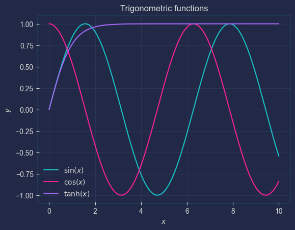

# Matplotlib stylesheet: PitayaRemix
All based on the `seaborn-darkgrid` style. To use, simply utilize the following URL:
```python
plt.style.use('https://github.com/kaiuki2000/PitayaRemix/raw/main/PitayaRemix.mplstyle')
```
## Pitaya Remix style
Fusion between [Pitaya Smoothie dark](https://github.com/dhaitz/matplotlib-stylesheets/tree/master) and [Pacoty](https://github.com/dhaitz/matplotlib-stylesheets/tree/master).
Sample image:


The python script utilized to generate this image is also supplied in this repository (`Example.py`).
